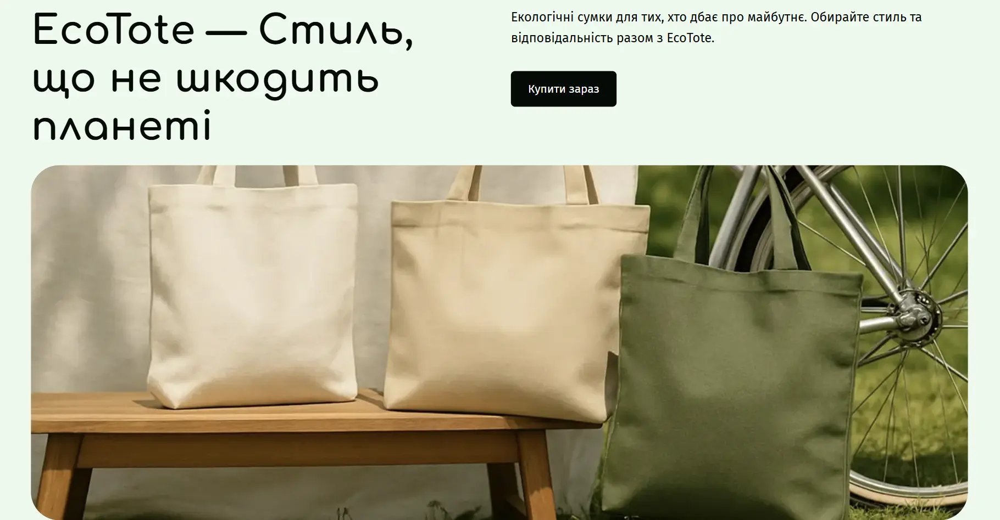

# EcoTote



## Про проєкт

**EcoTote** — адаптивний лендинг для бренду екологічних багаторазових сумок. Проєкт розповідає про переваги екосумок, демонструє асортимент товарів, відгуки покупців і містить форму зворотного зв’язку.

Це командний навчальний проєкт, створений із використанням семантичної HTML-розмітки, адаптивного дизайну та підходу Mobile First.

[Переглянути сайт](https://anastasiia-kosh.github.io/EcoTote/) · [Оригінальний командний репозиторій](https://github.com/TarasBilyi/nine-pixels-team)

## Основні можливості

- адаптивне відображення на мобільних, планшетних і десктопних пристроях;
- семантична HTML-розмітка;
- мобільне меню та навігація за секціями;
- адаптивні й оптимізовані зображення;
- плавні переходи та інтерактивні елементи;
- автоматичне збирання проєкту за допомогою Vite.

## Моя роль і внесок

У цьому проєкті я виконувала роль **Scrum Master**: допомагала організовувати командну роботу, координувати виконання завдань і підтримувати комунікацію між учасниками.

Моїм технічним завданням була розробка секції **«Наші сумки / Assortment»**:

- створила HTML-розмітку восьми карток товарів;
- реалізувала адаптивне компонування секції для мобільних, планшетних і десктопних екранів;
- налаштувала адаптивне завантаження зображень;
- оптимізувала зображення для швидшого завантаження сторінки;
- додала ліниве завантаження зображень;
- реалізувала стилі та інтерактивні стани кнопок.

## Технології


## Запуск локально

```bash
git clone https://github.com/Anastasiia-Kosh/EcoTote.git
cd EcoTote
npm install
npm run dev
```

Після запуску відкрийте адресу, вказану Vite у терміналі.

## Командна робота

Проєкт створено в межах командної розробки. Усі учасники та повна історія внесків доступні в [оригінальному репозиторії](https://github.com/TarasBilyi/nine-pixels-team).

## Макет

[Figma](https://www.figma.com/design/RCf95cRtisUxC8gsNFAFAp/EcoTote?node-id=5999-10563&p=f&t=8oMXFlsDwecHQ6NU-0)
